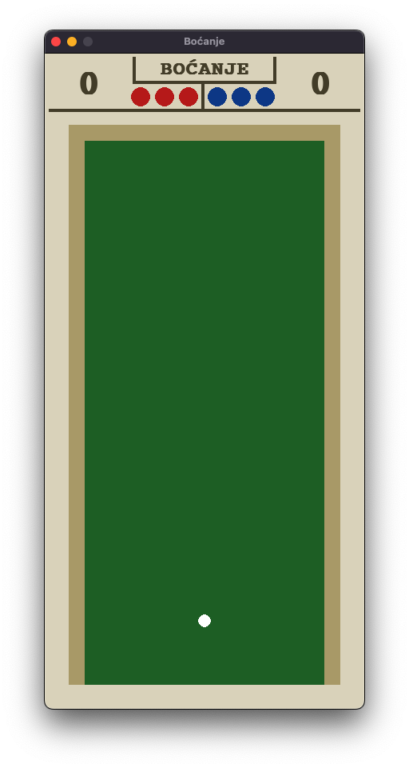

# Bocce Ball 2D
## Game Rules
The game comprises a rectangular field bounded on three sides. Each player possesses 3 balls, and the game proceeds until one player scores 13 points.

- At the outset, a player of choice throws a small white ball, followed by one of their three balls. 
- Players take turns throwing their balls until all 6 balls are on the field. 
- Points are awarded based on the proximity of a player's balls to the white ball compared to their opponent's balls, with a maximum of 3 points per ball.

  <video src="images/example.mov" width="400" />

## Movement Mechanics

### Linear Movement
Linear kinematics, utilizing the RK4 method, control the balls movement along the track.

- Initial values of current position and velocity along the x and y axes are passed.
- The return value includes the position and velocity of the ball in the next iteration.

### Restricted Movement
Balls are constrained to remain within the field boundaries, and overlap is not allowed. 

- Collision handling resolves issues related to restricted movement.

## Collision Detection

### Circle-Circle Collisions
Assuming equal mass and no friction, collisions occur if the distance between two balls is less than the sum of their radii.

- Upon collision, the angle between their new directions is straight.

### Circle-Line Collisions
Collisions between a circle and a line occur if the distance between the line and the circle's center is less than the circle's radius.

- The circle is deflected at the same angle at which it approached the line.

## Spatial Indexing
To expedite collision detection, the sweep and prune mechanism is employed.

- We sort the y-coordinates of all balls and check for potential collisions.
- The process iterates through all balls on the field, checking only for collisions within the range formed by at least 2 balls.

